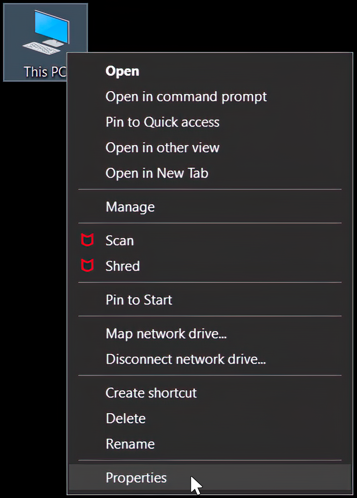

# Mobile-Automation
 
This application automate tasks in Android mobile.

## Requirement
1. Android Debugging Bridge (adb).
2. Path to adb.exe should exist environment PATH variable.

## Setup
1. Download ADB for windows from the below link.
    https://developer.android.com/studio/releases/platform-tools
     
2. Extract the zip file to c drive.
3. After extraction right click 'This PC' or 'My Computer' and click properties.

&nbsp;&nbsp;&nbsp;
